<div align="center">

# 🌱 PlantMitra AI

### AI-Powered Plant Disease Detection & Intelligent Crop Health Platform


<p>
PlantMitra AI combines <strong>Computer Vision</strong>, <strong>Natural Language Processing</strong>, and <strong>Machine Learning</strong> to help users identify plant diseases, understand symptoms, and receive actionable treatment recommendations through a production-oriented full-stack application.
</p>

<p>

[](https://react.dev)

[](https://fastapi.tiangolo.com)

[](https://pytorch.org)

[](https://huggingface.co/docs/transformers)

[](https://www.sqlalchemy.org)

[](https://docs.astral.sh/uv/)

[](https://www.docker.com)

</p>

<p>

<a href="https://plantmitraai.vercel.app">

</a>

<a href="https://alokrj-plant-disease-backend.hf.space/docs">

</a>

<a href="https://github.com/alokrj01/ai-plant-doc">

</a>

</p>

</div>

---

# 📖 Overview

Plant diseases can significantly affect crop health and agricultural productivity. However, identifying a disease from visual symptoms or incomplete descriptions often requires domain expertise.

**PlantMitra AI** provides an AI-assisted plant health platform that combines image-based disease detection with symptom-based text analysis.

Users can:

- Upload an image of an affected plant leaf
- Describe symptoms in natural language
- Receive an AI-generated disease prediction
- View prediction confidence
- Understand the detected disease
- Receive treatment recommendations
- Review prevention strategies

The project is designed not only as an ML application, but as a **full-stack AI system with a production-oriented backend, API layer, containerized deployment, dependency locking, and environment-based configuration.**

---

# 🎯 Project Goals

PlantMitra AI was designed around three major goals:

### 1. AI-Assisted Diagnosis

Use machine learning models to identify potential plant diseases from visual and textual inputs.

### 2. Accessible Plant Health Guidance

Transform model predictions into understandable disease information and actionable treatment recommendations.

### 3. Production-Oriented Engineering

Build the system using modern backend engineering practices including:

- RESTful APIs
- Modular service architecture
- Dependency locking
- Environment-based configuration
- Docker containerization
- CPU-optimized inference
- API documentation
- Automated deployment

---

# ✨ Key Features

## 🤖 AI Disease Detection

### 📸 Image-Based Prediction

Upload a plant leaf image and receive:

- Predicted disease
- Confidence score
- Disease information
- Severity information
- Treatment recommendations
- Prevention strategies

### 📝 Text-Based Prediction

Describe visible symptoms in natural language and receive an AI-assisted disease prediction using a transformer-based NLP model.

---

## 🔬 Disease Analysis

PlantMitra goes beyond returning a simple class label.

The result layer provides:

- 🦠 Disease identification
- 📊 Prediction confidence
- 📖 Disease description
- 🚨 Severity information
- 💊 Treatment recommendations
- 🛡 Prevention strategies

---

# 🏗️ System Architecture

```text
                         ┌──────────────────────────┐
                         │      React Frontend      │
                         │      Vite + Tailwind     │
                         └────────────┬─────────────┘
                                      │
                                      │ REST API
                                      ▼
                         ┌──────────────────────────┐
                         │      FastAPI Backend     │
                         │                          │
                         │  Authentication / APIs   │
                         │  Request Validation      │
                         │  Prediction Services    │
                         └────────────┬─────────────┘
                                      │
                    ┌─────────────────┴─────────────────┐
                    │                                   │
                    ▼                                   ▼
          ┌───────────────────┐              ┌────────────────────┐
          │ Image Prediction  │              │ Text Prediction    │
          │                   │              │                    │
          │ PyTorch CNN       │              │ Transformers       │
          │ Torchvision       │              │ Hugging Face       │
          └─────────┬─────────┘              └─────────┬──────────┘
                    │                                  │
                    └────────────────┬─────────────────┘
                                     ▼
                         ┌──────────────────────────┐
                         │     Prediction Layer     │
                         │                          │
                         │ Disease Mapping          │
                         │ Confidence Processing    │
                         │ Treatment Information    │
                         └────────────┬─────────────┘
                                      │
                                      ▼
                         ┌──────────────────────────┐
                         │        Database          │
                         │   SQLAlchemy + SQLite    │
                         └──────────────────────────┘
```

# ⚙️ Backend Architecture

The backend is built using **FastAPI** and follows a modular service-oriented structure.

```text
backend/
├── config/
│   ├── __init__.py
│   └── mappings.py
│
├── services/
│   ├── __init__.py
│   ├── image_service.py
│   └── text_service.py
│
├── Models/
│   ├── best-model-text/
│   ├── cnn_model.pth
│   ├── encoder.pkl
│   └── readme.md
│
├── database.py
├── loader.py
├── main.py
├── model1.py
├── models.py
├── seed_data.py
├── startup.py
│
├── Dockerfile
├── .dockerignore
├── pyproject.toml
├── uv.lock
└── requirements.txt
```
requirements.txt is retained for compatibility during the migration from pip to uv. The current Docker and development workflow is based on pyproject.toml and uv.lock.

# 🧠 Machine Learning Architecture

PlantMitra uses multiple ML components for different prediction tasks.

## Image Model
The image prediction pipeline uses:
- PyTorch
- TorchVision
- Scikit-learn
- Numpy
- Pillow

The trained CNN model analyzes plant leaf images and predicts the corresponding disease category.

## Text Model
The text prediction pipeline uses:
- Hugging Face Transformers
- Tokenizers
- Safetensors
- Hugging Face Hub

The model precesses natural-language descriptions of plant symptoms and predicts potential diseases.

# 🛠️ Tech Stack

## Frontend
- React.js
- Vite
- Tailwind CSS
- React Router
- Lucide Icons
- Axios

## Backend
- Python 3.12
- FastAPI
- Uvicorn 
- Pydantic
- SQLAlchemy
- SQLite
- Python Multipart

## Machine Learning
- Pytorch
- TorchVision
- Transformers
- Hugging Face Hub
- Scikit-learn
- Numpy
- SciPy
- Joblib
- Pillow

## DevOps & Deplyment
- Docker
- uv
- uv.lock
- GitHub Actions
- Hugging Face Spaces
- Vercel

# 📦 Dependency Management with uv
PlantMitra uses uv for modern Python dependency management.

Instead of relying on an unstructured environment or installing dependencies individually, the project uses:

```text
pyproject.toml
       +
uv.lock
       ↓
Reproducible Python environment
```
The lockfile preserves the exact dependency versions used by the application.

This is particularly important for the ML stack because packages such as:
- PyTorch
- Torchvision
- NumPy
- Scipy
- Scikit-learn
- Transformers
- Tokenizers
can have compatibility constraints.

## CPU-Optimized PyTorch

PlantMitra currently uses CPU builds:
```text
torch==2.8.0+cpu
torchvision==0.23.0+cpu
```
This keeps the deployment suitable for CPU-based cloud environments such as the current Hugging Face deployment.

# 🐳 Docker Deployment

The backend is containerized using Docker.

The Docker image:
- Uses Python 3.12
- Installs dependencies using uv
- Uses the locked dependency graph
- Uses CPU-based PyTorch
- Runs as a non-root user
- Exposes port 7860
- Starts FastAPI using Uvicorn

The production container uses:
```text
uv sync --locked
```
This ensures that the Docker environment is synchronized with uv.lock.

## Container Architecture
```text
Docker Image
│
├── Python 3.12
├── uv
├── pyproject.toml
├── uv.lock
│
├── FastAPI
├── PyTorch CPU
├── Transformers
├── Scikit-learn
└── PlantMitra Application
        │
        ▼
   Port 7860
```
# 🔄 CI/CD

PlantMitra uses GitHub Actions to automatically synchronize the backend with its Hugging Face deployment.
```text
Developer
    │
    ▼
Git Push → main
    │
    ▼
GitHub Actions
    │
    │ backend/** changed
    ▼
Subtree Deployment
    │
    ▼
Hugging Face Space
    │
    ▼
Docker Build
    │
    ▼
uv sync --locked
    │
    ▼
FastAPI Backend
```
This allows backend changes to be automatically propagated to the Hugging Face deployment.

# 🌍 Environment Configuration

The frontend uses environment-specific API configuration.

## Development
```text
VITE_API_URL=http://localhost:7860
```
## Production
```text
VITE_API_URL=https://alokrj-plant-disease-backend.hf.space
```
This allows the same frontend codebase to communicate with either the local development backend or the production API.

# 🚀 Getting Started
## Prerequisites

Make sure you have:

- Git
- Node.js 18+
- Python 3.12+
- uv
- Docker (optional, for containerized development)

# 📥 Model Setup

⚠️ The trained ML models are large and are not included in the Git repository.

Download the required models from the provided model storage links and place them inside:
```text
backend/Models/
```

Required structure:
```text
backend/
└── Models/
    ├── cnn_model.pth
    ├── encoder.pkl
    └── best-model-text/
        ├── config.json
        ├── model.safetensors
        ├── tokenizer.json
        ├── tokenizer_config.json
        ├── special_tokens_map.json
        └── vocab.txt
```
# 💻 Local Development
## 1. Clone the Repository
```text
git clone https://github.com/alokrj01/Plant_Mitra_AI
cd plant-mitra-ai
```
## 2. Setup the Backend
```text
cd backend
```

### Install the locked dependency environment:
```text
uv sync
```
### Run the backend:
```text
uv run uvicorn main:app --reload --host 127.0.0.1 --port 7860
```
### The API will be available at:
```text
http://localhost:7860
```
### Swagger API documentation:
```text
http://localhost:7860/docs
```
## 3. Run the Frontend

Open another terminal:
```text
cd frontend
npm install
npm run dev
```
The frontend will be available through the Vite development server.

Make sure <strong>.env.development </strong> contains:
```text
VITE_API_URL=http://localhost:7860
```

# 🐳 Running with Docker

### Build the backend image:
```
cd backend

docker build -t plant-mitra-backend:uv .
```

### Run the container:
```
docker run --rm -p 7860:7860 plant-mitra-backend:uv
```
### Open:
```
http://localhost:7860/docs
```
### The container runs the same locked dependency environment defined by:
```
pyproject.toml
uv.lock
```

# 🔌 API Endpoints
### Method	Endpoint	         Description
     GET	   /	               Backend health/status
     POST	   /text-prediction	 Predict disease from symptoms
     POST	   /image-prediction Predict disease from leaf image
     GET	   /docs	Interactive Swagger documentation

### Additional endpoints may be available depending on the current backend implementation.

# 🧪 Local Validation

The current development setup has been tested across:
```
Swagger → Text Prediction       ✅
Swagger → Image Prediction      ✅
Frontend → Text Prediction      ✅
Frontend → Image Prediction     ✅
Docker → FastAPI                ✅
Docker → ML Model Loading       ✅
CPU PyTorch Inference           ✅
```

# 🔐 Production-Oriented Engineering

PlantMitra incorporates several practices intended to make the project closer to a real-world backend system:

- REST API architecture
- Request validation using Pydantic
- Modular service layer
- SQLAlchemy database integration
- Environment-based configuration
- Reproducible dependency locking
- CPU-optimized ML inference
- Docker containerization
- Non-root container execution
- Automated GitHub Actions deployment
- Interactive OpenAPI / Swagger documentation
- Separate development and production API configuration

# 📊 Project Highlights
### AI Capabilities
- Image-based disease classification
- NLP-based symptom classification
- Confidence-aware predictions
- Disease information mapping
- Treatment recommendation system
### Backend Engineering
- FastAPI REST API
- Modular service architecture
- SQLAlchemy database layer
- Pydantic validation
- Dockerized deployment
- Reproducible dependency management with uv
### Deployment
- React frontend deployed separately
- FastAPI backend containerized with Docker
- Hugging Face Spaces backend deployment
- GitHub Actions-based backend synchronization
- CPU-based inference for resource-efficient deployment

# 🔮 Future Roadmap

PlantMitra AI is designed to evolve beyond basic disease classification.

Potential future capabilities include:

- 🌱 Multi-crop disease intelligence
- 📍 Location-aware crop recommendations
- 🌦️ Weather-aware disease risk prediction
- 📷 Continuous crop monitoring
- 📈 Disease trend analytics
- 🤖 AI agricultural assistant
- 🧑‍🌾 Personalized treatment plans
- 📊 Farmer and farm dashboards
- 🔐 Advanced authentication and authorization
- ⚡ Redis-based caching
- 📨 Background task processing
- 📡 Observability and structured logging
- ☁️ Scalable cloud infrastructure

# 📸 Application Preview
## Screenshots

### User Dashboard
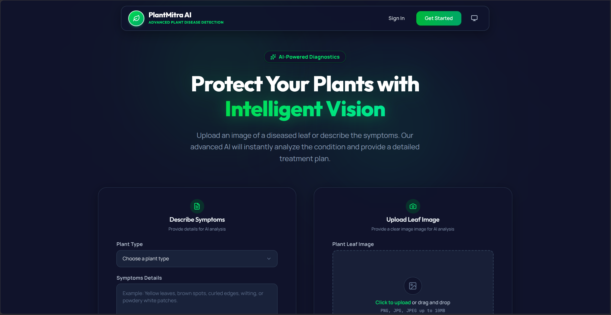
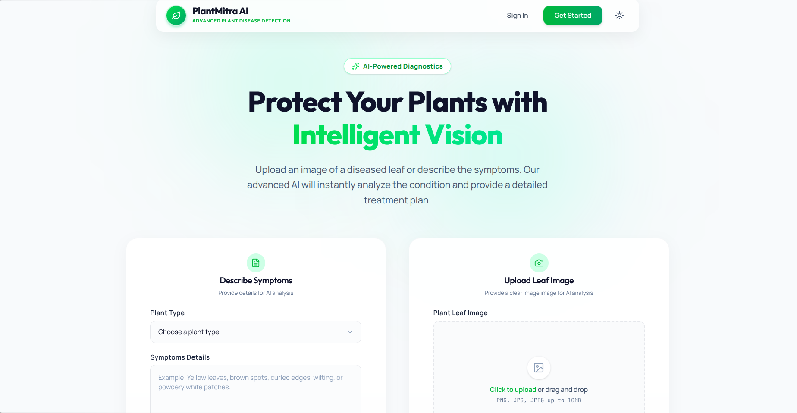

### Disease Detection
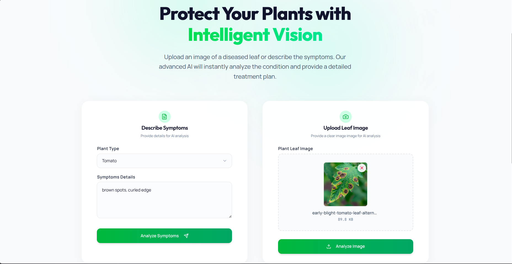

### Prediction Result
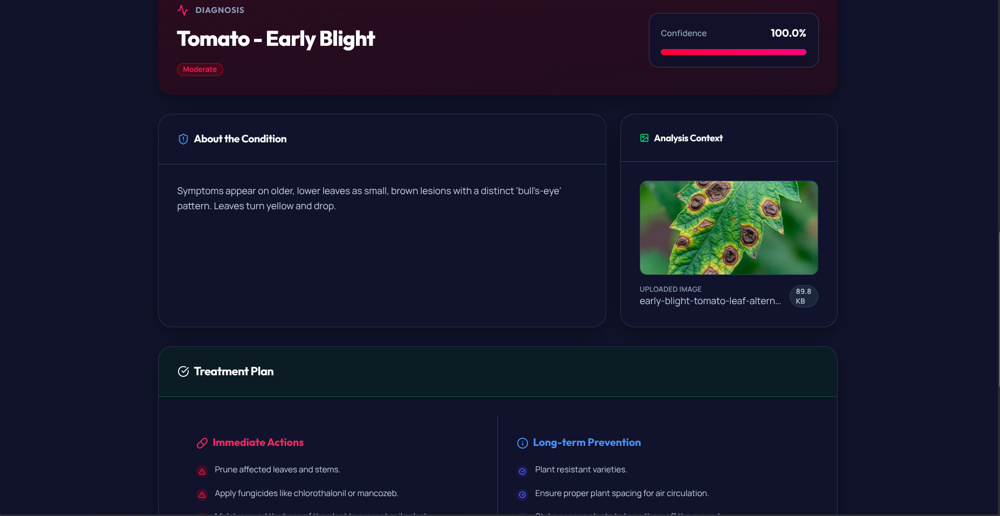
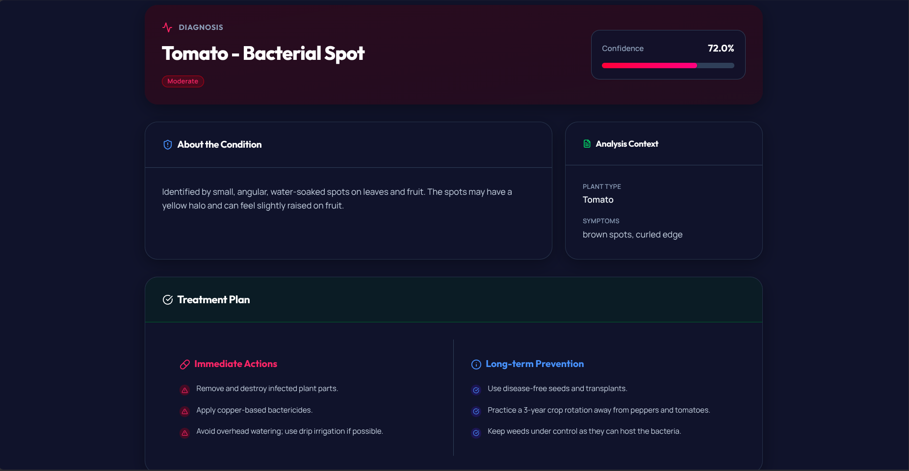

### Admin Dashboard
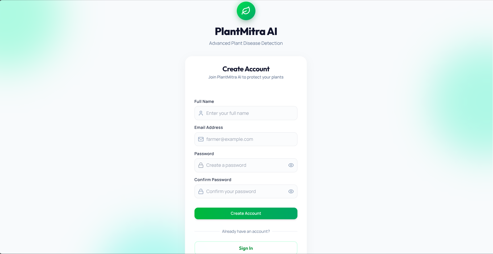
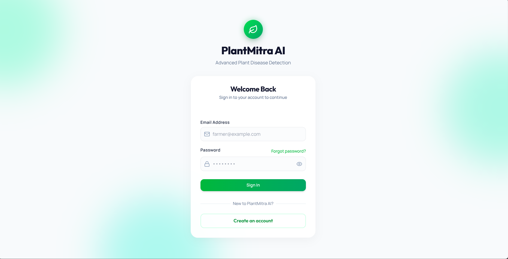

### API Documentation
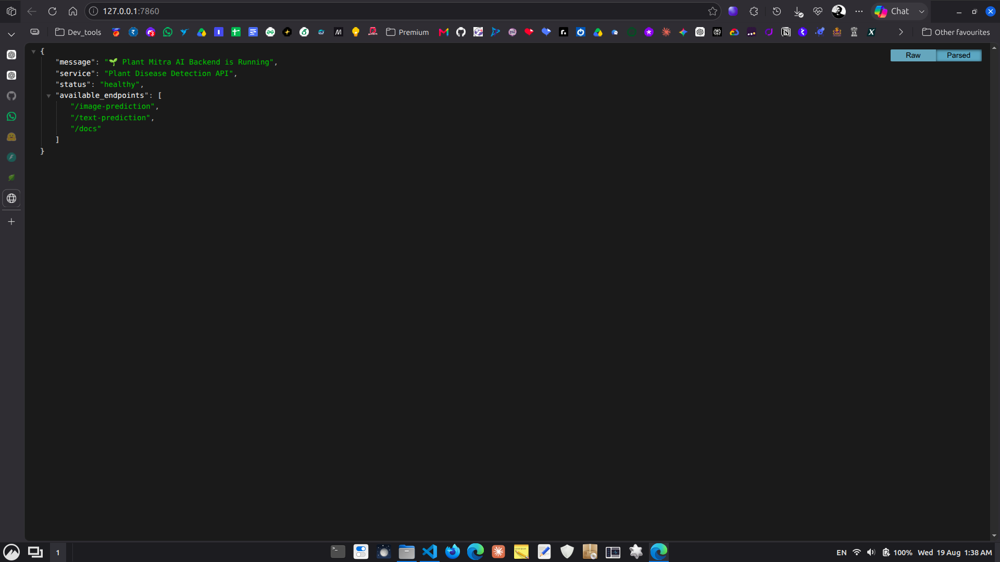
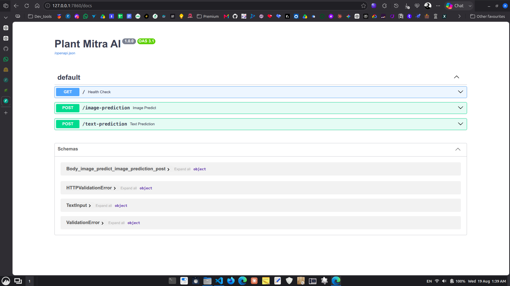

### Mobile View
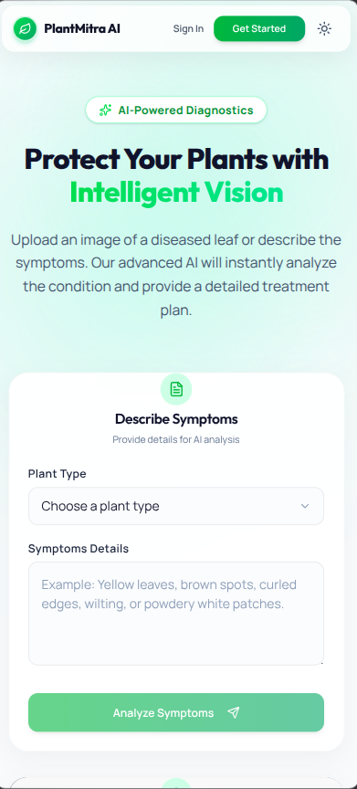
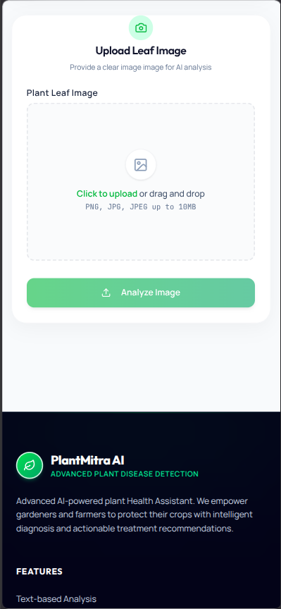

# 📁 Repository Structure
```
Plant-Mitra-AI/
│
├── .github/
│   └── workflows/
│       └── hf-sync.yml
│
├── backend/
│   ├── config/
│   ├── services/
│   ├── Models/
│   ├── database.py
│   ├── loader.py
│   ├── main.py
│   ├── model1.py
│   ├── models.py
│   ├── seed_data.py
│   ├── startup.py
│   ├── Dockerfile
│   ├── .dockerignore
│   ├── pyproject.toml
│   ├── uv.lock
│   └── requirements.txt
│
├── frontend/
│   ├── public/
│   ├── src/
│   ├── package.json
│   ├── package-lock.json
│   └── vite.config.js
│
├── .gitignore
└── README.md
```

# 🧩 Engineering Decisions
### Why FastAPI?

FastAPI provides:

- High-performance asynchronous APIs
- Automatic OpenAPI documentation
- Pydantic-based validation
- Python-native ML integration
- Clean dependency injection

### Why uv?

The project migrated from pip-based dependency management to uv to provide:

- Faster dependency installation
- Deterministic dependency resolution
- Lockfile-based reproducibility
- Better developer workflow
- Cleaner Docker builds

### Why CPU PyTorch?

The current deployment environment is CPU-based. Using the CPU builds of PyTorch and Torchvision avoids unnecessary CUDA dependencies and keeps the production image more suitable for CPU inference.

### Why Docker?

Docker provides a consistent runtime between local development and production and reduces environment-related deployment issues.

# 🎓 What This Project Demonstrates

PlantMitra AI demonstrates the integration of:
```
Frontend Engineering
        +
Backend Engineering
        +
Machine Learning
        +
API Design
        +
Database Integration
        +
Containerization
        +
Dependency Management
        +
CI/CD
        ↓
Production-Oriented AI Application
```
The project is intended to demonstrate not only model development, but also the engineering required to turn an AI model into a usable application.

# 👨‍💻 Author
<div align="center">
<strong> Alok Ranjan </strong>

Software Developer | Backend & AI Engineering

<a href="https://github.com/alokrj01">  </a> <a href="https://www.linkedin.com/in/alok-ranjan972">  </a> </div>

<div align="center">
🌱 PlantMitra AI

From plant symptoms to intelligent diagnosis.

Made with ❤️ by Alok Ranjan

</div>
